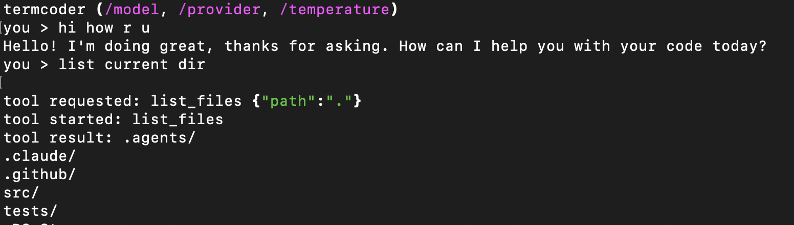

# termcoder

<p align="center">
  <strong>An open-source terminal coding agent in Python.</strong><br>
  Small enough to understand, useful enough to run on a real project.
</p>

<p align="center">
  <a href="https://github.com/nattergabriel/termcoder/actions/workflows/ci.yml"></a>
  <a href="https://github.com/nattergabriel/termcoder/blob/main/LICENSE"></a>
  <a href="https://www.python.org/downloads/"></a>
</p>

## What It Is

`termcoder` is a local coding agent that runs from your terminal. It can inspect a
project, explain code, edit files, run commands, and ask for approval before
taking actions that change your workspace.

It is also a readable implementation of a coding-agent harness: providers, tools,
commands, skills, permissions, and channels are kept separate so the system can
be understood and extended without digging through a large framework.

## Screenshot

<p align="center">
  
</p>

## Highlights

- Terminal-first coding workflow with streamed responses and live tool status.
- Built-in tools for reading, searching, writing, editing, moving, deleting, and
  running shell commands.
- Permission modes for different levels of trust: ask for every action,
  auto-allow read-only inspection, or run fully trusted.
- Provider support for OpenAI, Anthropic, and OpenAI-compatible endpoints such as
  OpenRouter or local servers.
- Project instructions through inherited `AGENTS.md` files.
- Local Agent Skills that can be activated inline with `/skill-name`.
- Terminal and Telegram channels behind the same agent loop.

## Quick Start

```bash
uv sync
export OPENAI_API_KEY="..."
uv run termcoder
```

To use Anthropic:

```bash
export ANTHROPIC_API_KEY="..."
uv run termcoder
/provider anthropic
/model <anthropic-model>
```

OpenAI-compatible providers can be used by setting `OPENAI_BASE_URL`.

## Configuration

Configuration is loaded from built-in defaults, then
`~/.config/termcoder/config.toml`, then `.termcoder.toml` in the current
project. Project settings override user settings. Secrets stay in environment
variables.

```toml
provider = "openai"
model = "gpt-4o-mini"
temperature = 0.7
permission_mode = "ask_each"
channel = "terminal"
max_iterations = 25
```

Supported `permission_mode` values are `ask_each`, `allow_readonly`, and
`allow_all`. Supported `channel` values are `terminal` and `telegram`.

## Extending termcoder

`termcoder` is organized around small, swappable pieces:

- providers adapt model APIs into the internal message and tool-call types
- tools expose file, search, edit, and shell capabilities through a registry
- channels handle user interaction without changing the agent core
- slash commands and skills add behavior without becoming part of the main loop

That shape keeps the core agent loop focused while making it straightforward to
add a provider, tool, command, skill, or channel.

## Development

```bash
uv run ruff check
uv run ruff format --check
uv run mypy .
uv run pytest
```

## License

[MIT](LICENSE).
